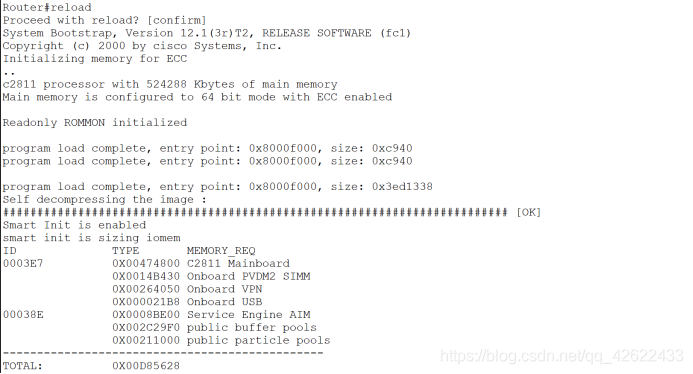

@[toc] 
## IOS是啥？
这里的IOS指的是网络操作系统，对目前的我来说就是**路由器**，将路由器和电脑连线后，我们可以在电脑上利用Secure CRT来连接路由器，使用命令对其进行配置。

## IOS的备份与更新：
就像手中的苹果手机每隔一段时间会更新ios系统一样，路由器的系统也需要更新。为了防止更新中出现如断电等意外情况，我们需要先对老系统进行备份。

## 备份与更新前的准备工作
**材料**：
1.console线
2.RS232转接线
3.双绞线（交叉线一根、直连线一根）
4.设备电源线（通用）
**软件**：
1.tftp服务器端
2.Secure CRT
（win xp系统是不需要的，XP系统自带一个“超级终端”）
3.RS232转换线驱动程序

**连线示意图：**


### 第一步
按照上述示意图将设备与电脑连接
### 第二步
将RS232转换线接在电脑上，安装驱动，然后查看是否安装成功。

PS：“com3”是RS232转接线在电脑上的硬件接口，相当于外接设备（键盘、鼠标等）
### 第三步
打开CRT，选择连接，选择protocol“serial”，端口“com3”（根据第二步查看到的端口），波特率“9600”（影响的是设备输出，波特率不正确，设备会输出乱码）。


### 第四步
配置路由器的接口Ip地址
注意：网线连接的设备接口，需要清楚的记得。


**路由器配置命令：**

```bash
no   ///新设备，是否进入配置指南，选择界面
en  
conf  t
int  e0/0  
no  sh
ip  add  192.168.1.1  255.255.255.0 
end
wr
```

### 第五步
设置本地电脑的IP地址


测试电脑和路由器之间的联通性：
本地电脑上，windows键+r，出现“运行”，输入“cmd”，回车，输入“ping  192.168.1.1”


## 开始IOS备份与更新
### 备份
到目前为止，连线完成，连接顺利，下面进行IOS备份和更新。
CRT上对路由器进行配置：
#### 第一步
查看设备现在的IOS文件
Show  flash: 
#### 第二步
IOS备份操作
先打开电脑上的“”，tftp服务器端开启。


上述完成后，不要关闭它！！！
CRT上继续对路由器进行配置：

查看是否正确备份：
按照tftp服务器上选择的根目录，打开文件夹，查看是否存在IOS。


### 更新：

 #### 第一步
 删除原有操作系统

```bash
en                         //即enable，获取root权限
show flash:           //找到当前使用的操作系统
delete flash:c2800nm-advipservicesk9-mz.124-15.T1.bin  
```


#### 第二步
导入新的操作系统 

```bash
//flash：类似于C:
//回车两次
copy tftp: flash:
192.168.1.100
c2800nm-advipservicesk9-mz.151-4.M4.bin
```


#### 第三步
软重启设备，运行新的IOS

```bash
reload
```




