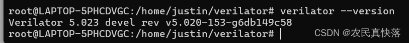

@[TOC]
# Windows下安装verilator
windows下安装比较麻烦，需要首先安装cygwin，cygwin是一个包管理工具，类似apt，然后通过cygwin安装verilator所需的各种依赖，然后再安装verilator。
[参考这篇文章，非常详细](https://blog.csdn.net/weixin_44989713/article/details/128652981#%E5%A6%82%E6%9E%9Ccygwin%E4%B8%AD%E6%9C%89%E5%8C%85%E5%BF%98%E8%AE%B0%E5%AE%89%E8%A3%85%E4%BA%86%E6%80%8E%E4%B9%88%E5%8A%9E)
# Ubuntu下安装verilator

## 安装前的准备

```bash
sudo apt-get install git help2man perl python3 make autoconf g++ flex bison ccache
sudo apt-get install libgoogle-perftools-dev numactl perl-doc
sudo apt-get install libfl2  # 只有ubuntu需要这一步 如果报错就跳过 
sudo apt-get install libfl-dev  # 只有ubuntu需要这一步 如果报错就跳过 
sudo apt-get install zlibc zlib1g zlib1g-dev  # 只有ubuntu需要这一步 如果报错就跳过 

git clone https://github.com/verilator/verilator  
```

如果git报错GnuTLS recv error (-110): The TLS connection was non-properly terminated
[参考这篇文章解决](https://blog.csdn.net/hnjzfwy/article/details/135314315)
## 安装verilator
```bash
unset VERILATOR_ROOT  
cd verilator
git pull         # 确保git仓库是最新的
git tag          # 查看版本号
#git checkout v3.922 切换到v3.922版本分支 没有版本需求可以忽略
autoconf         # 创建 ./configure 脚本
./configure      # Configure and create Makefile ， make这里执行的会比较慢，耐心等待。
make -j `nproc`  # Build Verilator itself (if error, try just 'make')
sudo make install
export VERILATOR_ROOT=$INSTALL_DIR  #这里INSTALL_DIR写verilator要安装的绝对路径
```
## 检查

```bash
verilator --version
```
出现版本号就成功了。


