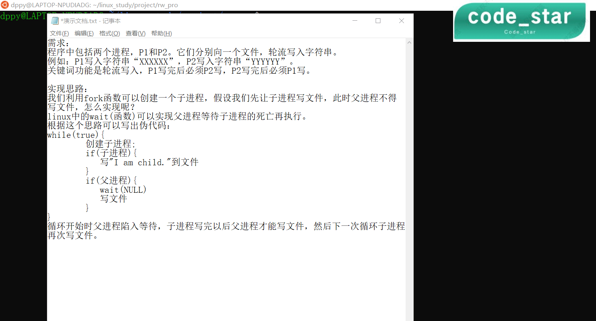

> 由于时间紧张和学识有限，代码定有不足之处(后面会抽时间优化)大佬勿笑~😀
> 如果需要帮助或有任何建议，加我qq：2287015934

@[TOC]
### 需求
程序中包括两个进程，P1和P2。它们分别向一个文件，轮流写入字符串。
例如：P1写入字符串“XXXXXX”，P2写入字符串“YYYYYY”。
关键词功能是轮流写入，P1写完后必须P2写，P2写完后必须P1写。

### 实现思路
我们利用fork函数可以创建一个子进程，假设我们先让子进程写文件，此时父进程不得写文件，怎么实现呢？
linux中的wait(函数)可以实现父进程等待子进程的死亡再执行。
根据这个思路可以写出伪代码：

```c
while(true){
       创建子进程;
	if(子进程){
	   写"I am child."到文件
	}
	if(父进程){
	   wait()
	   写文件
	}
}
```

循环开始时父进程陷入等待，子进程写完以后父进程才能写文件，然后下一次循环子进程再次写文件。

### 演示动图


### 源码

```cpp
#include <iostream>
#include <string>
#include <cstring>
#include <cstdlib>
#include <stdio.h>
#include <unistd.h>
#include <sys/types.h>
#include <sys/stat.h>
#include <sys/wait.h>
#include <netdb.h>
#include <arpa/inet.h>
#include <fcntl.h>
#include <dirent.h>
#include <signal.h>
using namespace std;
void UI();
char despath[200];
int main(){
	UI();
    pid_t pid;
	int cnt2=0;
	while(1){
	    pid=fork();
		if(pid<0){
			cout<<"error"<<endl;
		}
		else if(pid==0){
	        FILE* ch_fp=fopen(despath,"a");
			char buf[200];
			fprintf(ch_fp,"%s","child\n");
            printf("子进程向%s写入了child\n",despath);
			sleep(1);
			fclose(ch_fp);
			exit(0);
		}
		else{
			wait(NULL);
			FILE* pa_fp=fopen(despath,"a");
			char buf[200];
			fprintf(pa_fp,"%s","parent\n");
			printf("父进程向%s写入了parent\n",despath);
            fclose(pa_fp);
			sleep(1);
		}
	}
    return 0;
}
void UI(){
         printf("----------本程序实现了基于fork的多进程轮流写文件----------\n");
		 printf("      父子进程将轮流写入\"parent\"和\"child\"             \n");
         printf("      您可以自定义目标文件的路径                          \n");
		 printf("      请给出目标文件的路径:                               \n");
		 scanf("%s",despath);
}
```
使用g++编译运行即可。

### 联系方式
> 如果需要帮助或有任何建议，加我qq：2287015934

